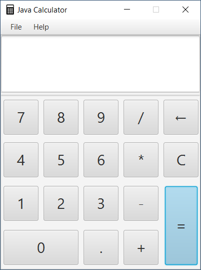

# Java Calculator

It'a simple calculator written in Java 11.

## Screenshot

## Build

Check out all the import statements with JDK 11.

Please note that Nashorn is deprecated in Java 11

## Release

I'm currently unable to package this project due to some errors with IntelliJ IDEA with JDK 11.  
The latest release was built with JDK 8 which includes JavaFX.

